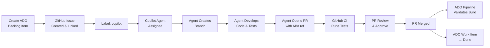

# ADO ↔ GitHub End-to-End Workflow

This document describes the automated pipeline that connects Azure DevOps (ADO) work item tracking with GitHub-based development using Copilot Coding Agent.

## Architecture Overview



## Workflow Steps

### 1. Create ADO Work Item
Create a Product Backlog Item in Azure DevOps:
- **Organization**: `https://dev.azure.com/brandsafway2`
- **Project**: `create_canvas`
- **Type**: Product Backlog Item

### 2. Create & Link GitHub Issue
When a GitHub issue is created with the `sync-ado` label:
- The `ado-sync.yml` workflow automatically creates a linked ADO backlog item
- A comment is added to the issue with the `AB#{id}` reference

**Alternatively**, use the Azure Boards GitHub App to create issues from ADO or link existing ones.

### 3. Assign Copilot Coding Agent
Add the `copilot` label to the GitHub issue:
- The `assign-copilot.yml` workflow automatically assigns the Copilot user
- Copilot Coding Agent picks up the issue and begins work

### 4. Agent Development Cycle
Copilot Coding Agent autonomously:
1. Creates a feature branch from `main`/`master`
2. Reads repo context (`.github/copilot-instructions.md`, `copilot-setup.yml`)
3. Implements code changes following project conventions
4. Writes tests for new functionality
5. Validates changes pass `npm run build` and `npm test` (per `copilot-setup.yml`)
6. Commits code with descriptive messages

### 5. Agent Opens Pull Request
Copilot creates a PR that:
- References the originating issue (`Closes #N`)
- Includes `AB#{id}` reference for ADO linkage
- Contains a summary of changes

### 6. CI Validation (GitHub Actions)
The `ci.yml` workflow runs on the PR:
- Tests against Node.js 18.x and 20.x
- Runs lint, build, and test steps
- Must pass before merge

### 7. Review & Merge
- Copilot Coding Agent addresses review comments
- Once approved, the PR is merged

### 8. ADO Pipeline Validation
On merge, `azure-pipelines.yml` triggers:
- Full build & test on `ubuntu-latest`
- Publishes JUnit test results
- Deploys to staging (when targeting `main`)

### 9. ADO Work Item Closure
The `ado-pr-status.yml` workflow:
- Detects merged PRs with `AB#` references
- Updates the linked ADO work item state to **Done**
- Adds a history comment with the PR link

---

## Prerequisites & Setup

### GitHub Secrets Required

| Secret | Description |
|--------|-------------|
| `ADO_PAT` | Azure DevOps Personal Access Token with **Work Items (Read & Write)** scope |

### GitHub Repository Settings

1. **Enable Copilot Coding Agent** — Org admin must enable for the repo under Settings → Copilot → Coding agent
2. **Branch protection** — Allow Copilot to create branches and push commits
3. **Labels** — Create `copilot` and `sync-ado` labels

### Azure DevOps Setup

1. **Azure Boards GitHub App** — Install from [marketplace](https://github.com/marketplace/azure-boards) and connect to your ADO project
2. **PAT generation** — Create a PAT at `https://dev.azure.com/brandsafway2/_usersSettings/tokens` with Work Items scope
3. **Pipeline connection** — Ensure the ADO pipeline is connected to this GitHub repo as a source

### Copilot Setup File

The `.github/copilot-setup.yml` defines the environment Copilot uses:
```yaml
steps:
  - name: Install dependencies
    run: npm ci
  - name: Build
    run: npm run build
  - name: Run tests
    run: npm test
```

---

## File Reference

| File | Purpose |
|------|---------|
| `.github/copilot-setup.yml` | Copilot Agent build/test environment |
| `.github/workflows/ado-sync.yml` | Syncs GitHub issues → ADO work items |
| `.github/workflows/assign-copilot.yml` | Auto-assigns Copilot on `copilot` label |
| `.github/workflows/ado-pr-status.yml` | Updates ADO work item on PR merge |
| `.github/workflows/ci.yml` | GitHub Actions CI (lint, build, test) |
| `azure-pipelines.yml` | ADO pipeline (build, test, deploy) |

---

## Troubleshooting

| Issue | Fix |
|-------|-----|
| ADO work item not created | Verify `ADO_PAT` secret has correct scopes and issue has `sync-ado` label |
| Copilot not assigned | Ensure Copilot Coding Agent is enabled for the repo and `copilot` label exists |
| Pipeline not triggering | Check that ADO pipeline source points to this repo and branch filters include `main`/`master` |
| AB# not linking | Ensure Azure Boards GitHub App is installed and PR body contains `AB#` reference |
